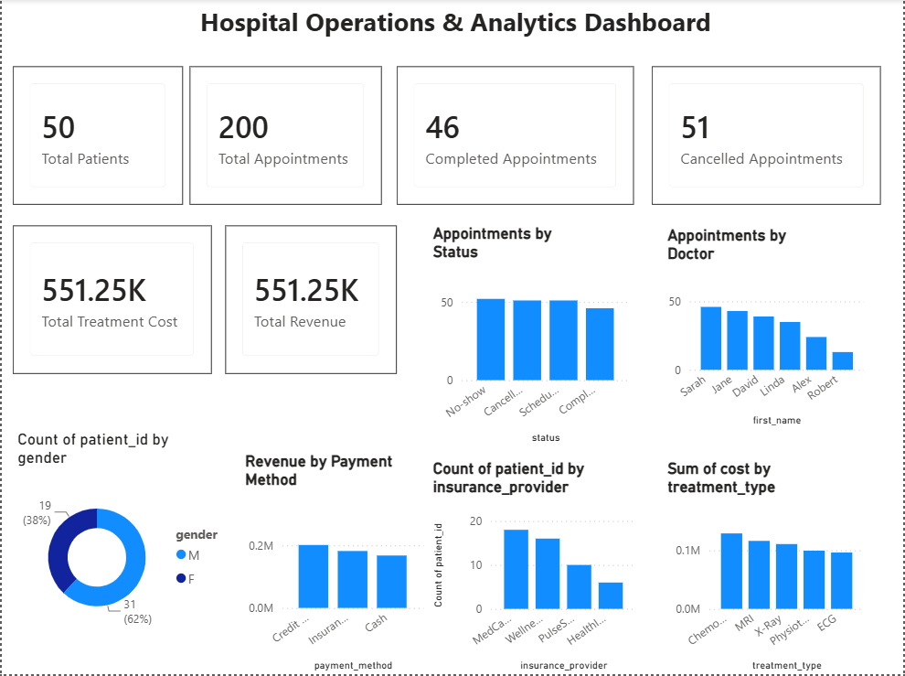
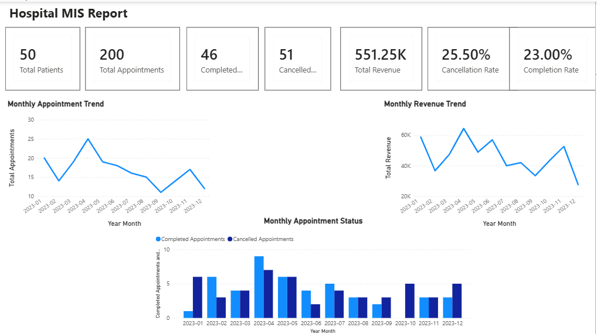
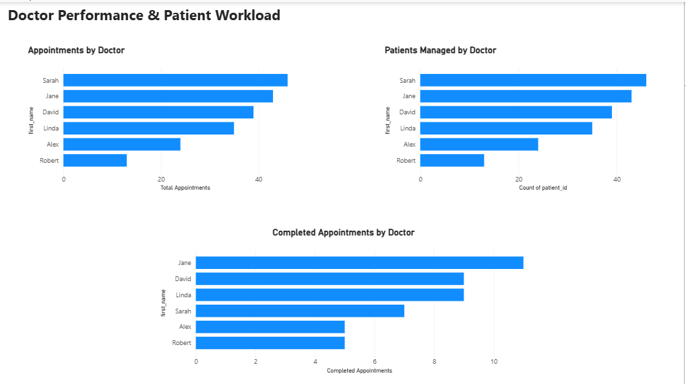

#Hospital Operations & Analytics Dashboard

Interactive **Hospital Operations & Analytics Dashboard** developed using Microsoft Power BI to analyze hospital performance, patient activity, appointments, treatments, doctor workload, MIS reporting, and financial information.

# Project Overview

This project analyzes hospital operational data to provide a clear and interactive view of key healthcare business metrics.

The dashboard brings together patient, appointment, doctor, treatment, billing, insurance, and payment-related information to identify operational patterns and support data-driven decision-making.

The analysis covers:

- Patient volume
- Appointment performance
- Appointment cancellation and completion
- Monthly appointment trends
- Monthly revenue trends
- Doctor workload
- Patient workload by doctor
- Treatment costs
- Revenue
- Payment methods
- Patient demographics
- Insurance distribution
- Management Information System (MIS) reporting

# Tools & Technologies

- Microsoft Power BI
- Power Query
- DAX
- Data Modeling
- Data Analysis
- Data Visualization
- MIS Reporting
- GitHub

# Dashboard Pages

# Page 1 — Hospital Operations Overview

Provides an overall view of hospital performance using KPIs and charts.

Key metrics include:

- Total Patients
- Total Appointments
- Completed Appointments
- Cancelled Appointments
- Total Treatment Cost
- Total Revenue
- Appointments by Status
- Appointments by Doctor

# Page 2 — Hospital MIS Report: Appointment & Revenue Analysis

Provides a **Management Information System (MIS) report** for monitoring hospital appointments, revenue, completion, and cancellation performance.

The report provides management-level visibility into operational performance through KPIs and monthly trend analysis.

Key analysis includes:

- Total Patients
- Total Appointments
- Completed Appointments
- Cancelled Appointments
- Total Revenue
- Cancellation Rate
- Completion Rate
- Monthly Appointment Trend
- Monthly Revenue Trend
- Monthly Appointment Status
- Completed Appointments by Month
- Cancelled Appointments by Month

# Page 3 — Doctor Performance & Patient Workload

Analyzes doctor-level performance and workload to understand how appointments and patients are distributed across doctors.

Key analysis includes:

- Appointments by Doctor
- Completed Appointments by Doctor
- Patients Managed by Doctor
- Doctor-wise Workload Comparison
- Doctor Performance Comparison
- Patient Workload by Doctor

# Dashboard Features

- Total Patients KPI
- Total Appointments KPI
- Completed Appointments KPI
- Cancelled Appointments KPI
- Total Revenue KPI
- Total Treatment Cost KPI
- Cancellation Rate
- Completion Rate
- Appointments by Status
- Appointments by Doctor
- Monthly Appointment Trend
- Monthly Revenue Trend
- Monthly Appointment Status
- Doctor Performance Analysis
- Patient Workload Analysis
- Doctor-wise MIS Reporting
- Revenue by Payment Method
- Patient Gender Analysis
- Insurance Provider Analysis
- Treatment Type Cost Analysis
- Interactive Data Analysis

# MIS Reporting

The project includes a dedicated **Hospital MIS Report** designed to provide summarized information for monitoring hospital operations and supporting management decision-making.

The MIS report focuses on:

- Overall patient and appointment KPIs
- Appointment completion and cancellation performance
- Cancellation Rate
- Completion Rate
- Monthly appointment trends
- Monthly revenue trends
- Monthly appointment status
- Doctor-wise workload
- Doctor performance
- Patient workload by doctor

This report demonstrates the use of Power BI for converting operational data into structured management information and actionable business insights.

# Project Objectives

- Monitor overall hospital patient and appointment activity
- Analyze completed and cancelled appointments
- Track monthly appointment trends
- Track monthly revenue trends
- Understand appointment status patterns
- Monitor cancellation and completion rates
- Understand doctor-wise appointment distribution
- Evaluate doctor performance
- Analyze patient workload by doctor
- Analyze revenue across different payment methods
- Evaluate treatment costs by treatment type
- Understand patient demographics
- Analyze insurance provider distribution
- Create management-level MIS reports
- Support data-driven operational decision-making

# Key Insights

The dashboard enables analysis of:

- Overall patient and appointment volume
- Appointment completion and cancellation patterns
- Monthly appointment trends
- Monthly revenue trends
- Monthly appointment status
- Cancellation and completion rates
- Doctor-wise appointment workload
- Doctor-wise completed appointments
- Patients managed by each doctor
- Patient distribution by gender
- Revenue generated through different payment methods
- Distribution of patients across insurance providers
- Treatment costs across different treatment types
- Overall hospital operational performance

# Power BI File

The complete Power BI dashboard is available below:

[Download Hospital Operations & Analytics Dashboard](./Hospital%20Operations%20%26%20Analytics%20Dashboard.pbix)

Skills Demonstrated

- Data Cleaning
- Data Transformation
- Data Modeling
- Data Analysis
- DAX Measures
- KPI Development
- MIS Reporting
- Management Reporting
- Dashboard Development
- Business Intelligence
- Data Visualization
- Power BI Reporting
- Operational Analytics

# Author

Amal M S

BCA Graduate | Aspiring Data Analyst

Skills:Power BI | SQL | Python | Data Analytics | Data Visualization
